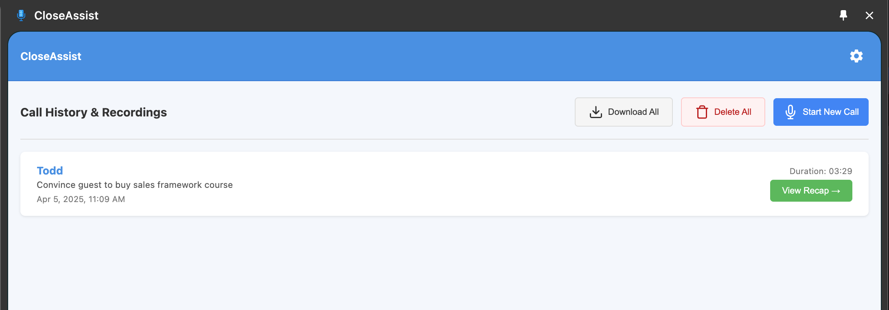
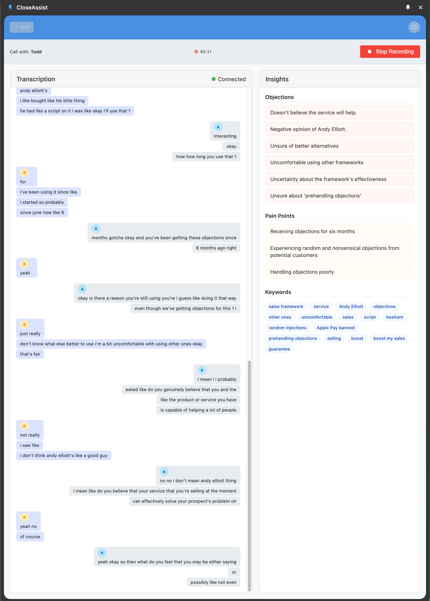

# CloseAssist Chrome Extension (Proof of Concept)

**⚠️ Important: This is a Proof of Concept (POC) and is NOT a finished product. It is not intended for distribution or production use.**

## Overview

CloseAssist is a Chrome extension POC designed to assist sales professionals during calls by providing real-time transcription and extracting key insights directly from browser tab audio and optional microphone input.

**This tool was developed solely for demonstration and conceptual validation.**




## Features (POC Implementation)

*   **Real-time Transcription**: Captures audio from the current browser tab (e.g., a web-based meeting platform) and optionally the user's microphone, transcribing it in real-time using Deepgram.
*   **Real-time Sales Insights**: Analyzes the live transcript using Google Gemini to identify and display potential:
    *   Pain Points mentioned by the prospect.
    *   Objections raised.
    *   Action Items discussed.
    *   Relevant Keywords.
*   **Side Panel Interface**: Controls recording and displays transcription/insights within the Chrome side panel.
*   **Recording History**: Stores past session transcripts and insights locally (audio is *not* stored).
*   **Data Download**: Allows downloading session transcripts and insights as a JSON file.

## Requirements

This POC requires API keys for third-party services:

1.  **Deepgram API Key**: For real-time transcription services.
2.  **Google Gemini API Key**: For analyzing the transcript and generating insights.

You must obtain these keys from Deepgram and Google AI Studio respectively and enter them into the extension's settings.

## ⚠️ Disclaimer and Usage Warning

*   **Use At Your Own Risk**: This extension is a POC and provided "as is" without warranty of any kind. Use it entirely at your own risk. The developers assume no liability for its use or misuse.
*   **Compliance is Your Responsibility**: Recording and transcribing conversations may be subject to laws and regulations (e.g., GDPR, CCPA, state-specific wiretapping laws). **It is solely your responsibility** to understand and comply with all applicable laws in your jurisdiction and the jurisdiction of all call participants.
*   **Consent Required**: You **must** inform all participants clearly and obtain their explicit consent **before** you start recording or transcribing any conversation using this tool. Failure to do so may violate privacy laws and regulations.
*   **POC Limitations**: As a proof of concept, this tool may contain bugs, inaccuracies, or incomplete features. It is not suitable for critical applications.
*   **No Distribution**: This POC is not intended for public distribution or commercial use.

## Setup (Developer Mode)

**1. Build the Extension (Required for Loading):**

   *   Before compiling the extension code, ensure all dependencies are installed by running `npm install` in the project's root directory:
       ```bash
       npm install
       ```
   *   After installing dependencies, you can compile the extension code. Open your terminal in the project's root directory and run the build command (this might be `npm run build`, `yarn build`, or similar, depending on the project setup):
       ```bash
       # Example build command (check your package.json)
       npm run build 
       ```
   *   This will create a `dist` (or similar) folder containing the compiled extension files, including the `manifest.json`.

**2. Load the Extension in Chrome:**

   *   Open Chrome and navigate to `chrome://extensions/`.
   *   Enable "Developer mode" (usually a toggle in the top-right corner).
   *   Click "Load unpacked".
   *   **Select the project folder** that contains the `dist` folder created by the build command.
   *   The extension icon should appear in your toolbar.

## How to Use (POC Workflow)

1.  Click the extension icon and open the side panel.
2.  Go to Settings (gear icon) and enter your Deepgram and Gemini API keys. Select transcription language. Configure audio sources (Tab Audio / Microphone).
3.  Navigate to the "Prepare Call" screen, enter details about the meeting/participants, and click "Start".
4.  Click "Start Recording" in the Live View. Ensure you have informed participants and obtained consent.
5.  Transcription and insights will appear in the side panel during the call.
6.  Click "Stop Recording" when finished.
7.  Navigate back to the "Call History & Recordings" view to see past sessions.
8.  Click on a past session to view the Recap, including transcript and insights.
9.  Use the download buttons to save session data (transcript/insights) as JSON.

## Privacy

*   API keys are stored locally in your browser's storage.
*   Transcription and insight data are processed by Deepgram and Google Gemini according to their respective privacy policies.
*   Session data (transcript, insights, metadata - **excluding audio**) is stored locally in your browser's storage until cleared or the extension is removed.
*   **No audio recordings are permanently stored by this extension.**
*   No data is sent to any servers controlled by the developer of this POC.

## License

This project is licensed under the MIT License - see the LICENSE file for details.
